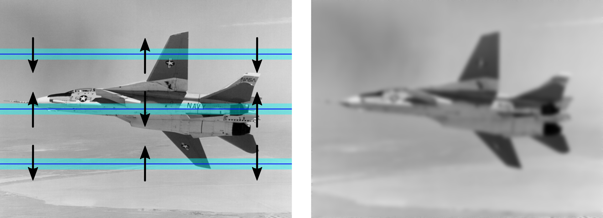

# MPI blurring
This program blurs PGM images with the use of Message Passing Interface. I've written it to learn parallel computing based on MPI standard. In the image below you can see how the multiprocess calculations are performed.



## Requirements
* CMake
* Make
* MPI (e.g. MPICH - [download](https://www.mpich.org/downloads/)) 
## Compilation and usage
First, clone the repository:
```
git clone https://github.com/sgol13/mpi-blurring.git
cd mpi-blurring
```

Then you can compile and use the program by means of the bash script `run`. The script takes four parameters.
```
./run [IN_FILE] [OUT_FILE] [ITERATIONS] [MARGIN]
```
For example:
```
./run examples/image1.pgm examples/image1_blurred.pgm 5 3
```
The program uses 4 processes by default. This value can be changed in `run` (variable `PROC`).
## License
This project is under MIT [license](LICENSE).
